# zapartabot
Збірник народних [повір'їв](https://slovnyk.ua/index.php?swrd=повір'я) для відгону растобісів.

## Чиї це вирази?
https://scholar.google.ru/citations?user=ND2LonwAAAAJ

## Як розгортати?
[Чит](https://slovotvir.org.ua/words/kod) написаний для Амазонівської Лямбди, тож на чомусь іншому навряд працюватиме зі старту. Існує декілька способів розгротки - для заможних і для бідних.

### Для заможних
На неповній потужності (тобто без HA чи більше однієї AZ, все суто в одинарному варіанті) обійдеться приблизно в 60 доларів на місяць, і найдорожчим буде використання NAT воріт (ґейтвеїв), за ним - ALB, а далі вже суто копійки на DNS та інші речі.

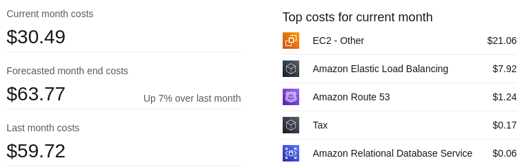

#### Мережа
З точки зору налаштування мережі необхідні наступні речі:
- NAT gateway (1 чи більше штук)
- Subnet (принаймні 2 штуки)
- Route table (2 штуки)
- Security group (1 штука)
- VPC endpoint gateway (1 чи більше штук)
- Internet gateway (1 штука)

Спочатку створюємо [торові](https://slovotvir.org.ua/words/marshrut) таблиці; IGW та NATGW сидітимуть у кожній наодинці, але поки що ми не можемо їх прописати.

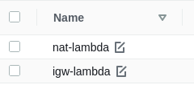

Далі йдуть мережі. Дана довідка описує нищуцьку версію заможного розгортання, а тому створюємо дві підмережі замість чотирьох. Одна має бути [доочною](https://slovotvir.org.ua/words/pryvatnyi), а інша відкритою (це встановлюєтья значеннями Auto-assign public IPv4 address та Enable auto-assign public IPv4 address).

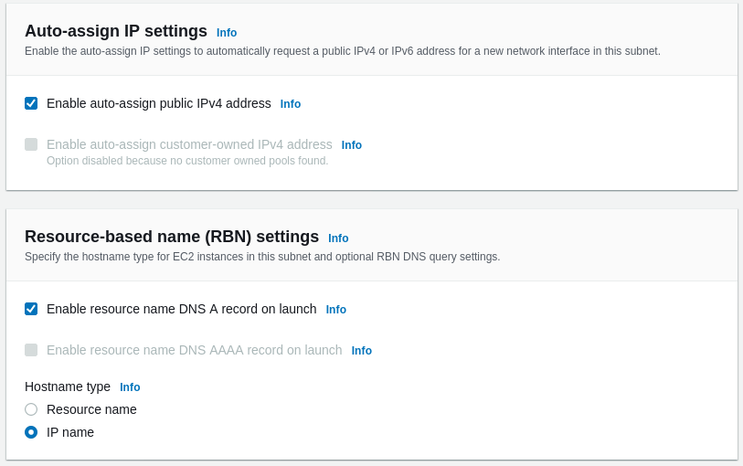

Йдемо у вкладення Endpoints, натискаємо кнопку для створення та заповнюємо все, що просить Амазон. Конкретно цю річ нам потрібно привести до ладу, щоб запити лямбди не йшли до S3 крізь Інтернет-мережу, а навпаки не полишали Амазонівський інтранет. Там, де треба вказати торову таблицю, вказуємо лише доочну.

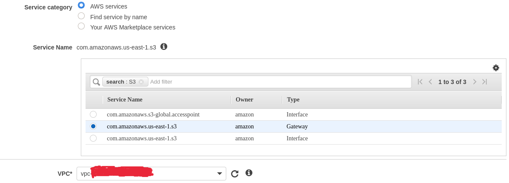

У частині, де просять вказати [кирмило](https://slovotvir.org.ua/words/polityka) для доступу, або залишаємо [ставильне](https://slovotvir.org.ua/words/standart) значення, або прописуємо щось схоже на наступне:
```
{
    "Version": "2012-10-17",
    "Statement": [
        {
            "Effect": "Allow",
            "Principal": "*",
            "Action": [
                "s3:PutObject",
                "s3:Get*"
            ],
            "Resource": "arn:aws:s3:::<наше відро>/*",
            "Condition": {
                "ArnEquals": {
                    "aws:PrincipalArn": "arn:aws:iam::<обліківка>:role/<лямбдівська роль>"
                }
            }
        },
        {
            "Effect": "Allow",
            "Principal": "*",
            "Action": "s3:List*",
            "Resource": "*",
            "Condition": {
                "ArnEquals": {
                    "aws:PrincipalArn": "arn:aws:iam::<обліківка>:role/<лямбдівська роль>"
                }
            }
        }
    ]
}
```

Підіймаємо IGW та NATGW. З першим все просто й без тонкощів, а за створення другого вказуємо підмережу, в якій надалі сидітиме ALB. Чому? Тому що як лямбда розгортається у VPC користувача, вона не має доступу до Інтернету, якщо для того немає умов у VPC, де її створили.

Йдемо до торових таблиць та додаємо шля до IGW до всіх, що мають слухати; ті, що мають говорити, повинні вказувати на NATGW.

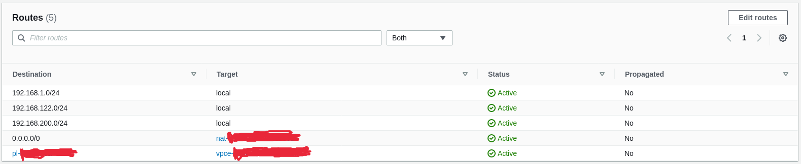

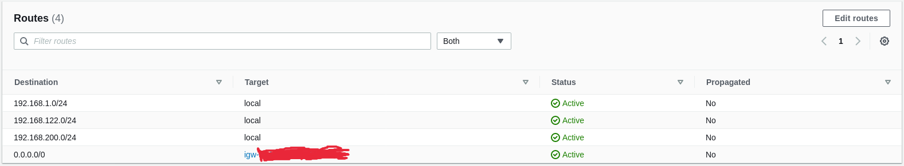

Останнім складовим цієї частини розгортання для заможних є оборонні [купи](https://slovotvir.org.ua/words/hrupa). Якщо є бажання обмазу, то виглядати купи повинні як наведено нижча. За відсутності бажання обмазатися безпекою достатньо буде повністю відкритої купи.

На вхід та вихід правила одні й ті ж, а Телеграм завжди сидітиме на конкретних підмережах. Там, де написано `Debugging only.`, можна додати власну IP.

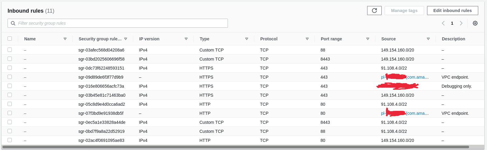

#### Доступ
З мережею розібралися, займемося питанням доступу. Підчас створення лямбди Амазон звісно запропонує створити необхідно налаштовану роль за тебе, але якщо є бажання зробити все самотужки, наступних дозволів буде достатньо для того, що робить чит.

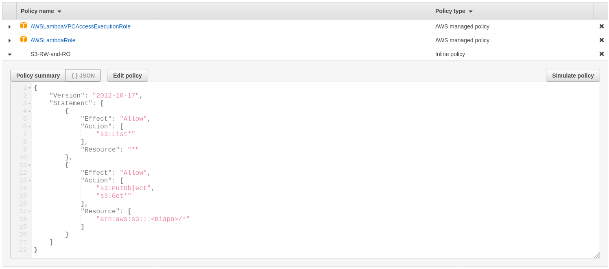

#### [Підоснова](https://slovotvir.org.ua/words/infrastruktura)

Повір'я не полетять у бік растобісів без лямбди, а лямбда нічого не скаже без [пусковика](https://slovotvir.org.ua/words/tryher-psykholohiia) (у даному випадку ним слугуватиме Application Load Balancer) та списку повір'їв. При цьому Телеграм [вимагає](https://core.telegram.org/bots/webhooks#the-short-version) TLSv1.2 HTTPS з'єднання, а тому потрібне [засвідчення](https://slovotvir.org.ua/words/sertyfikat), яке на рівнозавантажувальник отримати не можна, тому що він належить Амазону, через що потрібен власний [іменний простір](https://slovotvir.org.ua/words/domen). Маємо наступний список:
- Route 53
- Certificate Manager
- Application Load Balancer
- Simple Storage Service
- Lambda

У R53 чи будь-якому іншому реєстраторі купляємо іменний простір. Далі йдемо до Certificate Manager та створємо засвідчення, котре вказує лише на щойно придбаний іменний простір. Десь запівгодини Амазон має підтвердити створення та покласти запис щодо власництва над засвідченням у записи твоєї обліківки.

Йдемо до розділу з EC2 та знаходимо пункт ALB. Розгортаємо його в тій підмережі (можна й потрібно в декількох одразу, але на те цей приклад і нищуцький), для яких ми створили торові таблиці з IGW. Слухачі (listeners) мають сприймати [роз'єми](https://slovotvir.org.ua/words/port) 443 та 8443. Десь тут Амазон має запитати про цільову купу, і через те, що її поки немає, доведеться створити; з налаштуваннями пограєшся сам. Трохи нижче йтиме частина, де треба вказати засвідчення з Управління Уасвідченнями (Certificate Manager). Ставленого кирмила буде достатньо для TLSv1.2, яке Телеграм хоче. 

Тепер як маємо рівнозавантажувальник, рушаймо в Route 53 та прописуємо там A запис, котрий слугуватиме гукалом (alias) для ALB.

Йдемо до С3, створюємо відро. Налаштування, окрім наведених нижче, особливого значення не мають.

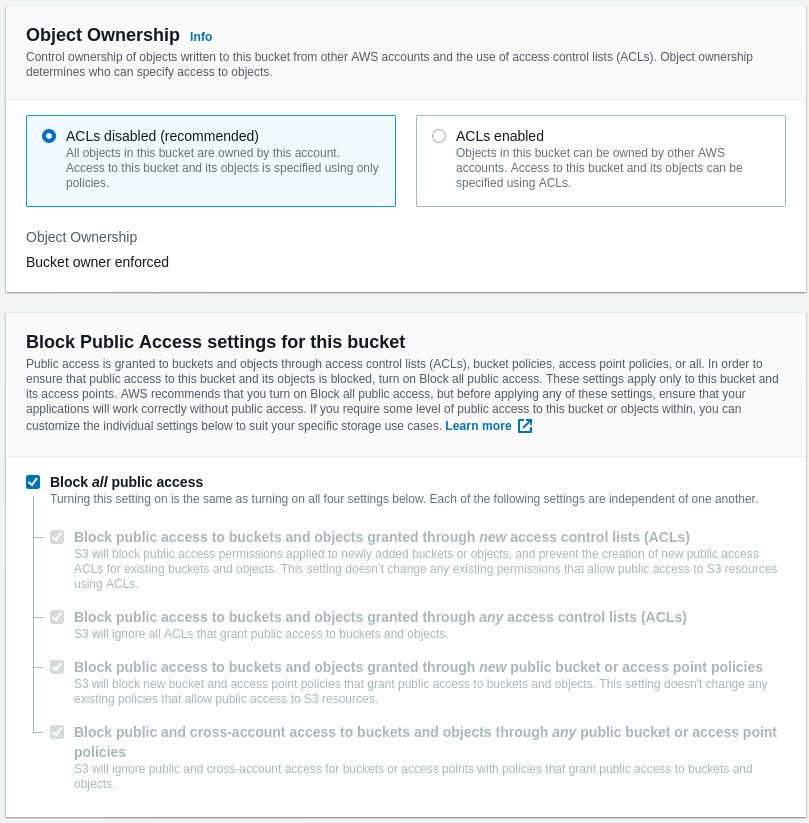

Щоб не платити занадто багато з часом за використане місце, можна додати ось таки киримло.

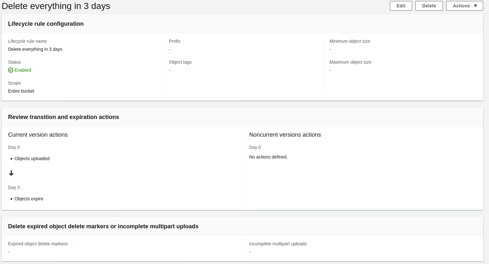

Таки нарешті створємо лямдбу. [Збірка](https://slovotvir.org.ua/words/versiia) Пайтона надто великого значення мати не повинна, будь-яку, що Амазон підтримує, можна використовувати. За створення лямбди не забуваємо обрати власну IAM роль та увімкнути мережу. У її налаштуваннях прописуємо ті підмережі, які мають тори до NATGW.

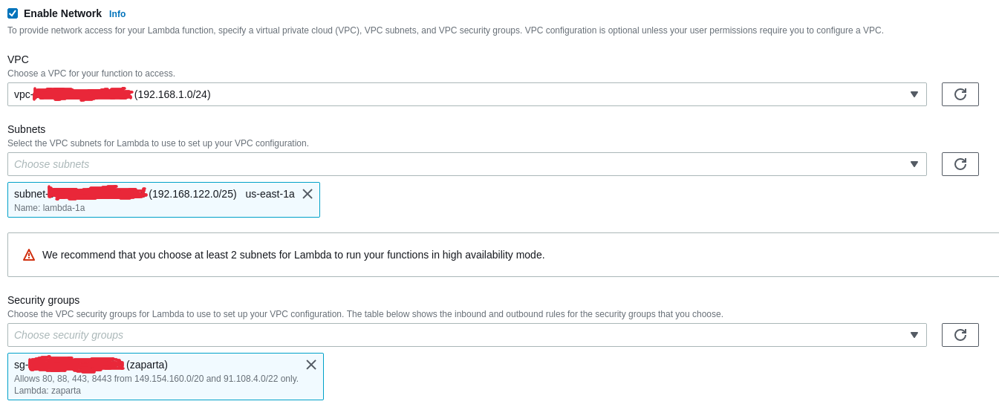

[Злучуємо](https://slovotvir.org.ua/words/intehratsiia) іменний простір із запартистом-терористом у Телеграмі та перевіряємо роботоздатність всього того, що ми щойно розгорнули.

### Для бідних

Потрібні:
- Lambda
- Simple Storage Service
- Identity and Access Management
- Certificate Manager
- Application Load Balancer
- Route 53

Створюємо роль для Лямбди.


Створємо S3 відро як описано у частині для багатих та додаємо наступне відерне кирмило:
```
{
    "Version": "2012-10-17",
    "Statement": [
        {
            "Sid": "Bucket",
            "Effect": "Allow",
            "Principal": "*",
            "Action": "s3:List*",
            "Resource": "arn:aws:s3:::<назва відра>",
            "Condition": {
                "ArnEquals": {
                    "aws:PrincipalArn": "arn:aws:iam::<обліківка>:role/<лямбдівська роль>"
                }
            }
        },
        {
            "Sid": "Objects",
            "Effect": "Allow",
            "Principal": "*",
            "Action": [
                "s3:PutObject",
                "s3:Get*"
            ],
            "Resource": "arn:aws:s3:::<назва відра>/*",
            "Condition": {
                "ArnEquals": {
                    "aws:PrincipalArn": "arn:aws:iam::<обліківка>:role/<лямбдівська роль>"
                }
            }
        }
    ]
}
```

Купляємо іменний простір та беремо на нього засвідчення для шифрування інформації, що йтиме на рівнозавантажувач. Створємо ALB як описано в частині для заможних (підмережі, IGW та торові таблиці з оборонними купами також знадобляться).

Розгортаємо лямбду, злучуємо її з Телеграмом та перевіряємо роботоздатність створеного.
